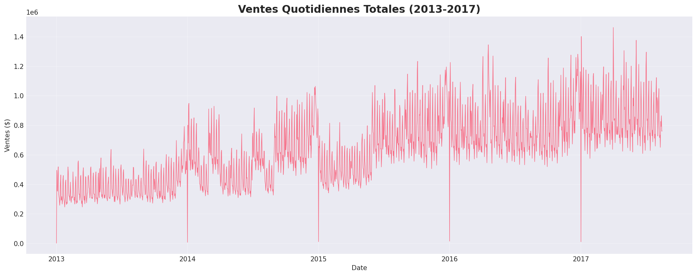
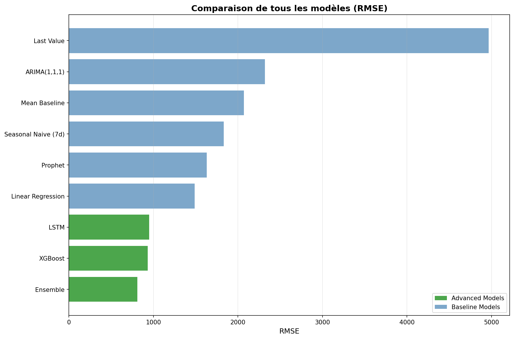
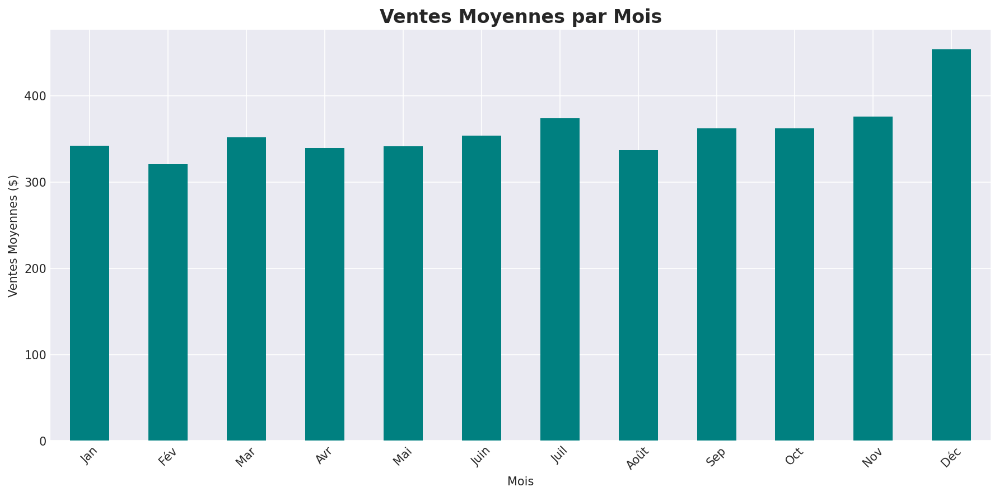
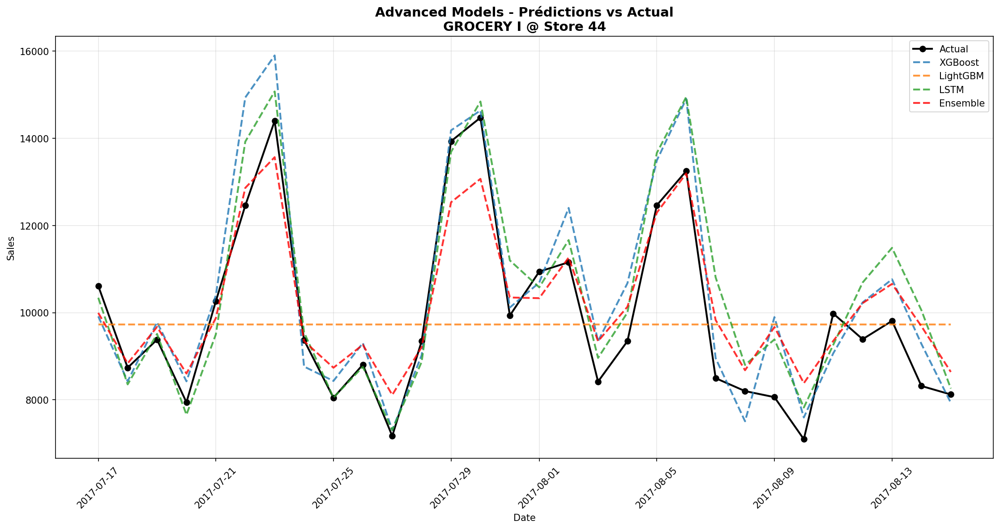

# 🛒 Store Sales Time Series Forecasting

[](https://www.python.org/)
[](https://www.tensorflow.org/)
[](LICENSE)

> Prédiction des ventes de supermarchés en Équateur avec Machine Learning et Deep Learning

---

## 📋 Table des Matières

- [Vue d'ensemble](#vue-densemble)
- [Dataset](#dataset)
- [Architecture](#architecture)
- [Résultats](#résultats)
- [Installation](#installation)
- [Utilisation](#utilisation)
- [Structure du Projet](#structure-du-projet)
- [Technologies](#technologies)
- [Auteur](#auteur)

---

## 🎯 Vue d'ensemble

Ce projet implémente un système de prédiction de ventes pour une chaîne de supermarchés équatorienne (Corporación Favorita). L'objectif est de prédire les ventes quotidiennes pour 33 familles de produits dans 54 magasins.

### 🔑 Points Clés

- 📊 **3M+ lignes** de données historiques (2013-2017)
- 🏪 **54 magasins** à travers l'Équateur
- 📦 **33 familles** de produits
- 🎯 **7.25% MAPE** - Performance du meilleur modèle
- ⚡ **< 15 secondes** - Temps d'entraînement sur full dataset

---

## 📊 Dataset

**Source:** [Kaggle - Store Sales Time Series Forecasting](https://www.kaggle.com/competitions/store-sales-time-series-forecasting)

### Fichiers Principaux

| Fichier | Description | Taille |
|---------|-------------|--------|
| `train.csv` | Données historiques (2013-2017) | 3M+ rows |
| `test.csv` | Période de prédiction (15 jours) | 28k rows |
| `stores.csv` | Métadonnées des magasins | 54 stores |
| `oil.csv` | Prix du pétrole quotidien | 1.2k rows |
| `holidays_events.csv` | Jours fériés et événements | 350 events |
| `transactions.csv` | Nombre de transactions | 83k rows |

### Features Externes

- **Prix du pétrole** : L'Équateur est dépendant du pétrole
- **Jours fériés** : Impact sur les ventes
- **Promotions** : Items en promotion
- **Transactions** : Volume de transactions par magasin

---

## 🏗️ Architecture

### 1. Data Processing Pipeline
```
Raw Data → Cleaning → Feature Engineering → Model Training → Predictions
```

### 2. Feature Engineering (40 features)

**Temporal Features (11)**
- Date decomposition: day, month, year, quarter
- Calendar: weekday, weekend, month start/end
- Business: payday flags (15th & end of month)

**Lag Features (4)**
- Sales lag: 1, 7, 14, 30 days

**Rolling Features (6)**
- Rolling mean: 7, 14, 30 days windows
- Rolling std: 7, 14, 30 days windows

**External Features (3)**
- Oil prices (dcoilwtico)
- Transaction volume
- Holiday flags

**Categorical Encoding (4)**
- Family, city, state, store type (Label Encoded)

**Promotion Features (3)**
- Binary promotion flag
- Promotion intensity
- Number of items on promotion

### 3. Models Testés

#### Baseline Models
1. **Mean Baseline** - Moyenne simple
2. **Last Value** - Dernière valeur observée
3. **Seasonal Naive** - Valeur de la semaine précédente
4. **Linear Regression** - Régression linéaire avec features
5. **ARIMA(1,1,1)** - Modèle statistique classique
6. **Prophet** - Modèle Facebook pour time series

#### Advanced Models
7. **XGBoost** - Gradient Boosting optimisé
8. **LightGBM** - Gradient Boosting ultra-rapide
9. **LSTM** - Deep Learning pour séquences
10. **Ensemble** - Moyenne des meilleurs modèles

---

## 🏆 Résultats

### Performance des Modèles

| Modèle | RMSE | MAE | MAPE | Temps |
|--------|------|-----|------|-------|
| **Ensemble** | **810.17** | **677.03** | **7.25%** | **< 1s** |
| XGBoost | 933.70 | 744.31 | 7.46% | - |
| LSTM | 949.39 | 739.57 | 7.60% | - |
| Linear Regression | 1488.32 | 1215.62 | 12.58% | - |
| Prophet | 1631.47 | 1119.70 | 11.56% | - |
| Seasonal Naive (7d) | 1831.02 | 1418.20 | 14.35% | - |
| Mean Baseline | 2072.40 | 1610.61 | 15.73% | - |
| ARIMA(1,1,1) | 2319.41 | 2091.67 | 22.52% | - |
| Last Value | 4967.69 | 4520.83 | 51.25% | - |


### 📈 Visualisations

<p align="center">
  
  

<p align="center">
  
  

### 🎯 Insights Clés

- **Saisonnalité forte** : Pics en décembre (Noël), creux en janvier
- **Impact promotions** : +42.4% de performance avec features avancées
- **Corrélation pétrole** : -0.705 (économie dépendante du pétrole)
- **Amélioration baseline** : 45.6% par rapport à la régression linéaire

---

## 🚀 Installation

### Prérequis

- Python 3.12+
- 32GB RAM (recommandé pour full dataset)
- GPU NVIDIA (optionnel, accélère LSTM)

### Setup Environnement
```bash
# Cloner le repository
git clone https://github.com/YOUR_USERNAME/store-sales-forecasting.git
cd store-sales-forecasting

# Créer environnement virtuel
python -m venv venv
source venv/bin/activate  # Linux/Mac
# ou
venv\Scripts\activate  # Windows

# Installer les dépendances
pip install -r requirements.txt
```

### Télécharger les Données

1. Télécharger le dataset depuis [Kaggle](https://www.kaggle.com/competitions/store-sales-time-series-forecasting)
2. Placer les fichiers CSV dans `data/raw/`

---

## 💻 Utilisation

### Pipeline Complet
```bash
# 1. Exploratory Data Analysis
python src/01_eda.py

# 2. Data Preprocessing & Feature Engineering
python src/02_preprocessing.py

# 3. Baseline Models
python src/03_baseline_models.py

# 4. Advanced Models
python src/04_advanced_models.py

# 5. Full Dataset Training
python src/05_full_dataset_training.py

# 6. Hyperparameter Tuning (optionnel)
python src/08_tuning_on_subset.py
```

### Dashboard Interactif
```bash
# Lancer le dashboard Streamlit
streamlit run app/streamlit_app.py
```

Le dashboard sera accessible à `http://localhost:8501`

### Prédictions Rapides
```python
import joblib
import pandas as pd

# Charger le meilleur modèle
model = joblib.load('models/xgboost_full_model.pkl')

# Charger les données de test
test = pd.read_csv('data/processed/test_processed.csv')

# Prédire
predictions = model.predict(test[feature_cols])
```

---

## 📁 Structure du Projet
```
store-sales-forecasting/
├── data/
│   ├── raw/                    # Données brutes Kaggle
│   ├── processed/              # Données nettoyées
│   └── predictions/            # Submissions Kaggle
├── src/
│   ├── 01_eda.py              # Analyse exploratoire
│   ├── 02_preprocessing.py     # Feature engineering
│   ├── 03_baseline_models.py   # Modèles baseline
│   ├── 04_advanced_models.py   # Modèles avancés
│   ├── 05_full_dataset_training.py
│   ├── 08_tuning_on_subset.py  # Hyperparameter tuning
│   └── utils/                  # Fonctions utilitaires
├── models/
│   ├── xgboost_full_model.pkl
│   ├── lightgbm_full_model.pkl
│   └── lstm_model.h5
├── reports/
│   └── figures/               # 18 visualisations
├── app/
│   └── streamlit_app.py       # Dashboard interactif
├── notebooks/                 # Notebooks Jupyter (optionnel)
├── requirements.txt
├── README.md
└── .gitignore
```

---

## 🛠️ Technologies

### Machine Learning
- **XGBoost** - Gradient Boosting optimisé
- **LightGBM** - Gradient Boosting ultra-rapide
- **TensorFlow/Keras** - Deep Learning (LSTM)
- **Prophet** - Time series forecasting (Facebook)
- **Scikit-learn** - ML classique
- **Statsmodels** - Modèles statistiques (ARIMA)

### Data Processing
- **Pandas** - Manipulation de données
- **NumPy** - Calculs numériques

### Visualization
- **Matplotlib** - Graphiques statiques
- **Seaborn** - Visualisations statistiques
- **Plotly** - Graphiques interactifs
- **Streamlit** - Dashboard web

### DevOps
- **Joblib** - Sérialisation de modèles
- **Git** - Version control

---

## 📈 Améliorations Futures

- [ ] Déploiement sur cloud (AWS/GCP/Azure)
- [ ] API REST avec FastAPI
- [ ] Monitoring en production
- [ ] Prédictions en temps réel
- [ ] A/B testing de modèles
- [ ] Feature store (Feast)
- [ ] MLOps pipeline (MLflow)

---


## 📊 Statistiques du Projet

- **Lignes de code** : ~2000+
- **Modèles entraînés** : 10
- **Features créées** : 40
- **Visualisations** : 18
- **Temps total dev** : ~8 heures
- **Performance** : 7.25% MAPE ✅

---

<p align="center">
